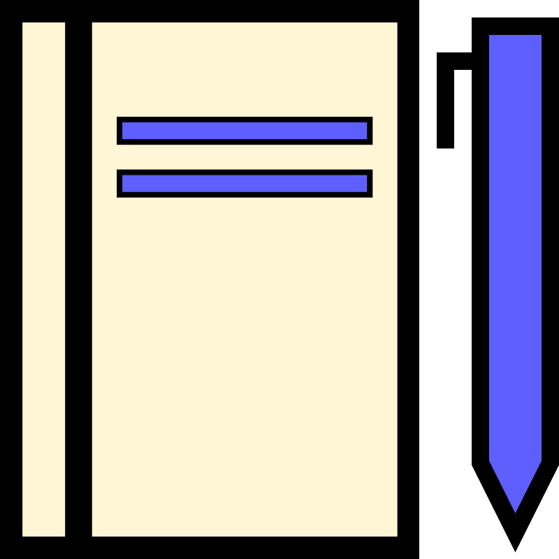

# Madrasa - School Payment Management System

A lightweight, mobile-friendly web application for managing student tuition payments in private schools. Built with React and designed for the Sudanese education system.



## 🌟 Features

### 📊 Dashboard
- Key metrics (Total Collected, Outstanding, Students)
- Collection rate percentage
- Grade-level progress bars
- Recent payments list
- Overdue students list
- Quick action buttons

### 👨‍🎓 Student Management
- Add, edit, and delete students
- Search by name
- Filter by grade level and payment status
- Quick action menu on student selection
- Payment status indicators (Paid/Partial/Unpaid)

### 💰 Payment System
- Record cash and bank transfer payments
- Support for 3 Sudanese banks:
  - Bank of Khartoum (Bankak/بنكك)
  - Omdurman National Bank (O-CASH/اوكاش)
  - Faisal Islamic Bank (Fawry/فوري)
- Transaction tracking with bank details
- Payment history with filters
- Real-time balance calculation

### 📈 Reports
- Summary by grade level
- Outstanding payments report
- Export to Excel (.xlsx)
- Export to PDF (via print)
- Collection rate visualization

### ⚙️ Settings
- Configurable tuition fees per grade
- School year management
- Data backup (JSON export)
- Data restore (JSON import)
- Sample data for testing

### 🌍 Language Support
- Arabic (default, RTL layout)
- English (LTR layout)
- Easy language toggle

### 📱 Mobile Responsive
- Works on all devices
- Touch-friendly interface
- Responsive tables and forms

## 🎓 Grade System

| Grade | Arabic | English |
|-------|--------|---------|
| First Year | السنة الأولى | First Year |
| Second Year | السنة الثانية | Second Year |
| Third Year | السنة الثالثة | Third Year |

## 💱 Currency

Sudanese Pound (SDG) - الجنيه السوداني

## 🛠️ Tech Stack

- **Frontend:** React 18 + Vite
- **Routing:** React Router DOM
- **Styling:** Plain CSS with CSS variables
- **State Management:** React Context API
- **Data Storage:** Browser localStorage
- **Excel Export:** xlsx library
- **Deployment:** Vercel

## 📦 Installation

### Prerequisites
- Node.js (v18 or higher)
- npm (v9 or higher)
- Git

### Local Development

```bash
# Clone the repository
git clone https://github.com/osmanfist/madrasa.git

# Navigate to project
cd madrasa

# Install dependencies
npm install

# Start development server
npm run dev

# Open http://localhost:5173